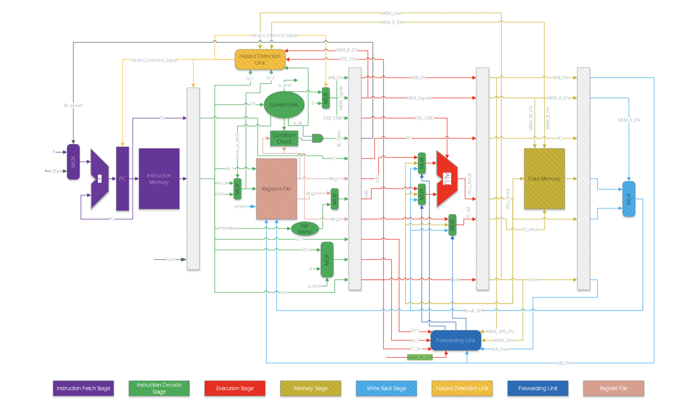

# MIPS-pipeline-processor

Thanks for visiting this repository!

This was developed as a personal project for the University of Florida's Independent Study credit, 
which required a LOT of research and guidance. This project implements a pipelined MIPS processor with hazard detection and forwarding.
This implementation is based on a limited ISA, the details for which are present in `docs/MIPS_ISA.png`.
This code is synthesizable and can be run on an FPGA. I used Altera DE2 units for testing purposes. The implementation has been verified using a relatively complex test program (found in `instructions/example_source_code.txt`).



## Getting Started

Download or clone the project, write your machine code to run (there already exists a default test program in the instruction memory),
compile the Verilog files and and run testbench.v in a Verilog simulation environment such as ModelSim from Mentor Graphics.

### Instruction format

Instructions should be provided to the instruction memory in reset time. I avoided the `readmemb` and `readmemh` functions to 
keep the code synthesizable. The instruction memory cells are 8 bits long, whereas each instruction is 32 bits long. 
Therefore, each instruction takes up four memory cells, as shown bellow.

For example, an add instruction: `10000000001000000000000000001010` or `Addi r1,r0,10` will need to be given as 

```
instMem[0] <= 8'b10000000;
instMem[1] <= 8'b00100000;
instMem[2] <= 8'b00000000;
instMem[3] <= 8'b00001010;
```

### Converting your raw machine codes

A Python script is provided under the `instructions/rearrange_instructions.py` directory which simply takes your 
machine code (in a specified format) and converts it to the format illustrated above.

### Enable/disable forwarding

An instance of the top-level circuit is taken in `testbench.v`. 
The inputs of the `MIPS_Processor` include `clk`, `rst`, and `forwarding_EN`.
Forwarding will be enabled if `forwarding_EN` is set to 1, and disabled otherwise.

## Under the hood

There are five pipeline stages: 

1. Instruction Fetch
2. Instruction Decode
3. Execution
4. Memory
5. Write Back

### Modular design

All modules are organized under the `modules` directory.
The top level description can be found under `topLevelCircuit.v`. It contains a **modular design** of the processor and 
encompasses five pipe stages and four pipe registers, the description for which are present under `modules/pipeStages` and 
`modules/pipeRegisters` respectively. The register file, the hazard detection and the forwarding units are also instantiated
in `topLevelCircuit.v`. Pipe stages are made of and encapsulate other supporting modules.

### Constants

`defines.v` contains project-wide constants for **opcodes**, **execution commands**, and **branch condition commands**. 
It also contains constants for wire widths and memory specifications. You can change memory size values to suit your needs.

### Wire naming convention

To maintain conformity, most wire names follow the format {wire description}_{wire stage}, where the second part describes 
the stage where the wire is located. For example, `MEM_W_EN_ID` is the memory write enable signal present in the instruction decode stage.

## Contributions

Contributions are welcomed, both general improvements as well as new features such as a more realistic memory heirarchy or branch prediction (that actually works). However, please follow the coding styles and the naming convention. Another useful contribution would be more comprehensive testing and verification and bug report.
